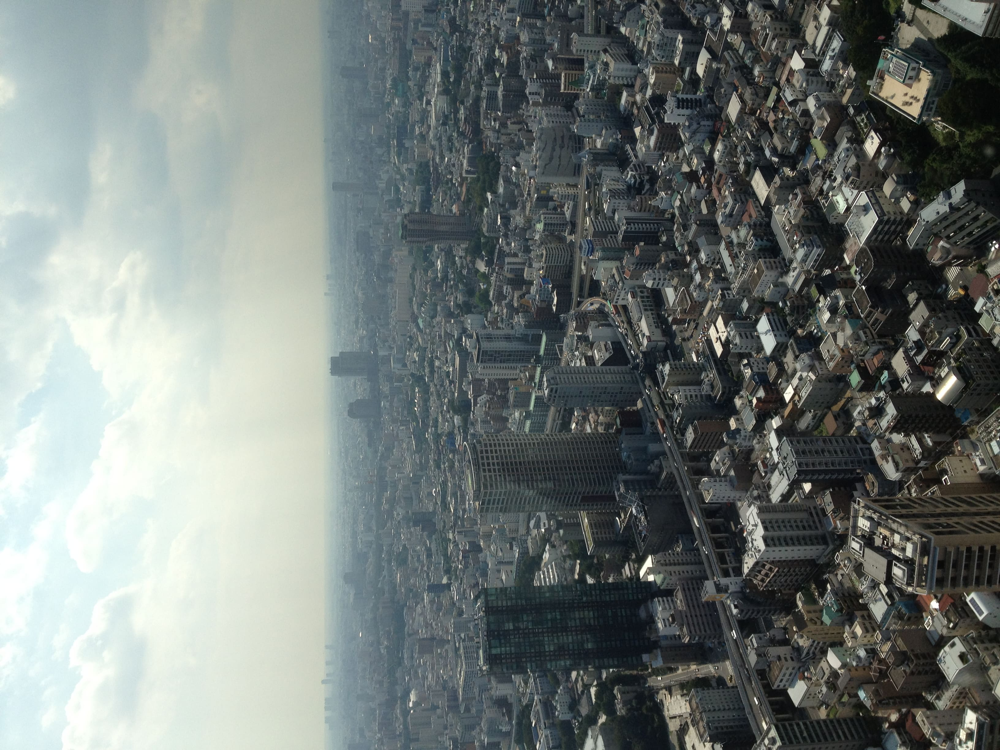

<!-- _class: first -->

# How much do you know about Tokyo?

- Takayasu Nasu

---

<!-- _class: none -->

    

### Have you ever been to Tokyo?

### Tokyo is one of the interesting cities in the world.

### I really like Tokyo, I lived there for 7 years before I had moved to Vancouver.

### That's why I want you guys to know more in terms of Tokyo today I chose this topic.

---

<!-- _class: gallery -->

## My gallery of Tokyo

- 
- 
- 
- 
- 
- 
- 
- 
- 
- 
- 
- 
- 
- 
- 
- 

---

<!-- _class: gallery -->

## Let's learn about Tokyo togetter.

### I will be given you a quiz about Tokyo.

### How many questions can you answer correctly?

---

<!-- _class: q none -->

## Q1. How many the population(approximately)  of the greater Tokyo area?

1. 10,750,000
1. 28,750,000
3. 37,750,000

---

<!-- _class: a none -->

## A. 3   37,750,000

Tokyo has 37,750,000 people, and the second largest is Jakarta with 31,320,000 people. Vancouver, by the way, has 2,460,000.

---

<!-- _class: q none -->

## Q2. How mach the total production(approximately)  of the greater Tokyo area?

1. 1,334.2 billion U.S. dollars
1. 1,536.9 billion U.S. dollars
3. 1,736.9 billion U.S. dollars

---

<!-- _class: a none -->

## A. 2   1,536.9 billion U.S. dollars

Tokyo's total production is about1,536.9 billion U.S. dollars.
The second largest is New York has about 1,334.2 U.S. dollars.

---

<!-- _class: youtube none -->

## Top 5 Things to do in Tokyo

<figure>
  <iframe width="950" height="530" src="https://www.youtube.com/embed/Hr_TbL5ejuQ" title="YouTube video player" frameborder="0" allow="accelerometer; autoplay; clipboard-write; encrypted-media; gyroscope; picture-in-picture" allowfullscreen></iframe>
</figure>
