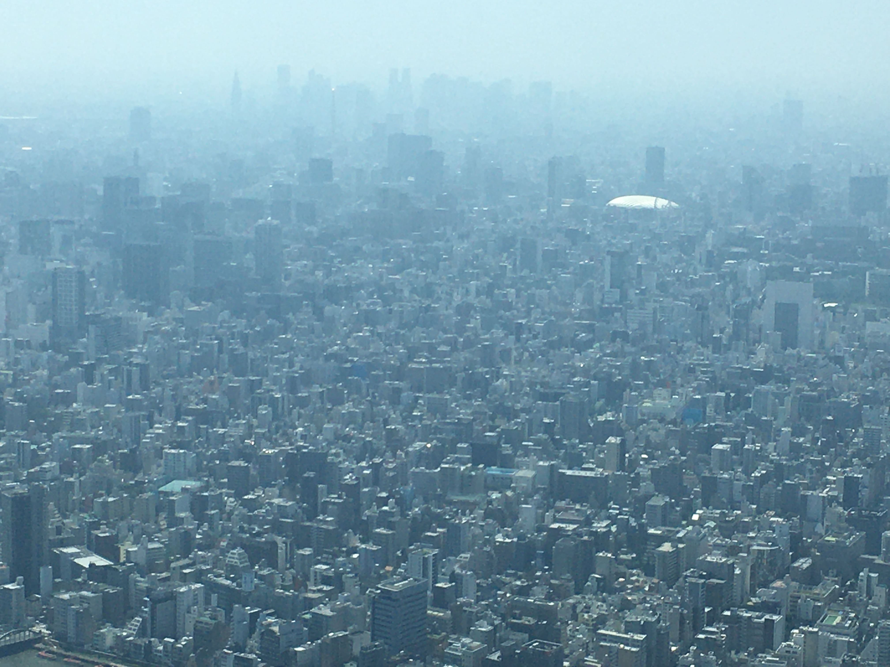

<!-- _class: first -->

# How much do you know about Tokyo?

- Takayasu Nasu

---

<!-- _class: gallery -->

## My gallery

- 
- 
- 
- 
- 
- 
- 
- 
- 
- 
- 
- 
- 
- 
- 
- 

---

<!-- _class: gallery none -->

## Let's learn about Tokyo togetter.

### I will be given you a quiz about Tokyo.

### How many questions can you answer correctly?

---

<!-- _class: q -->

## Q1. How many the population(approximately) of the greater Tokyo area?

1. 100
1. 200
3. 333

---

<!-- _class: a -->

## A. 1 aaa

hogefuga

---

<!-- _class: youtube none -->

## Top 5 Things to do in Tokyo

<figure>
  <iframe width="950" height="530" src="https://www.youtube.com/embed/Hr_TbL5ejuQ" title="YouTube video player" frameborder="0" allow="accelerometer; autoplay; clipboard-write; encrypted-media; gyroscope; picture-in-picture" allowfullscreen></iframe>
</figure>
